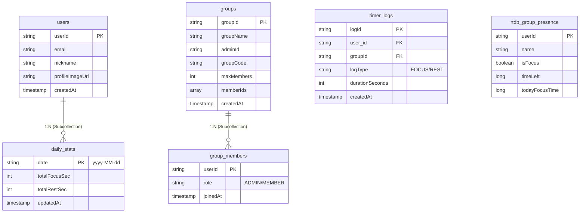

# Pocus Sharing - 최종 산출물

## 1. 주제 및 주요 기능
- **주제**: 뽀모도로(Pomodoro) 기법을 활용한 실시간 그룹 집중 시간 공유 어플리케이션입니다.
- **주요 기능**:
  - **커스텀 다이얼 타이머**: 1분 단위 스냅 및 햅틱 피드백을 제공하는 직관적인 원형 타이머.
  - **모드 전환**: 라디오 버튼을 통한 뽀커스(집중, 분홍색) 및 휴식(초록색) 모드 시각적 전환.
  - **실시간 그룹 연동**: Firebase Realtime DB를 통해 그룹원들의 타이머 상태와 남은 시간을 실시간으로 공유.
  - **기록 및 통계**: 타이머 종료 시 Firestore에 로그를 저장하고 일일 누적 집중 시간을 테이블 형태로 제공.

---

## 2. 구현한 클래스 목록 및 기능 설명
- **`HomeFragment`**: 메인 화면으로, 개인 타이머 조작, 뽀커스/휴식 모드 선택, 오늘 누적 집중 시간 및 타이머 히스토리(표 형태)를 보여줍니다.
- **`GroupDetailActivity`**: 특정 그룹의 상세 화면으로, 내 타이머 조작과 더불어 그룹원들의 실시간 타이머 상태 및 집중 시간을 그리드 형태로 보여줍니다.
- **`TimerView`**: 터치 이벤트를 처리하여 1분 단위 스냅과 햅틱 피드백을 발생시키며, 모드에 따라 아크 색상을 변경하는 커스텀 타이머 UI 뷰입니다.
- **`FirestoreRepository`**: Firestore를 이용해 유저, 그룹, 타이머 로그 정보를 저장하고 트랜잭션(WriteBatch)으로 일일 통계를 업데이트합니다.
- **`RtdbRepository`**: Firebase Realtime Database를 사용하여 그룹 멤버들의 실시간 접속 상태와 현재 남은 시간, 모드(isFocus)를 동기화합니다.
- **모델 클래스(`User`, `Group`, `TimerLog`, `MemberStatus` 등)**: DB에 매핑되는 데이터 구조체로 사용자 정보, 그룹 정보, 타이머 기록 등을 정의합니다.

---

## 3. DB ERD (Mermaid)



---

## 4. 중요 코드 블럭 및 구현 로직 설명

### 4.1. `TimerView` 스냅 및 햅틱 로직 (TimerView.java)
```java
float rawProgress = (float) (angle / 360f);
int minutes = Math.round(rawProgress * 60);
if (minutes != lastSnappedMinute) {
    lastSnappedMinute = minutes;
    setProgress(minutes / 60f);
    performHapticFeedback(HapticFeedbackConstants.CLOCK_TICK);
}
```
**설명**: 다이얼 드래그 시 각도를 이용해 시간을 계산하고 반올림하여 1분 단위로 스냅되도록 처리합니다.
이전 분과 달라질 때만 `CLOCK_TICK` 햅틱 피드백을 발생시켜 기계식 다이얼의 조작감을 구현했습니다.

### 4.2. 일일 통계 원자적 업데이트 (FirestoreRepository.java)
```java
batch.set(userStatRef, new HashMap<String, Object>() {{
    put("totalFocusSec", FieldValue.increment(focusInc));
    put("totalRestSec", FieldValue.increment(restInc));
}}, SetOptions.merge());
```
**설명**: 타이머 종료 시 WriteBatch를 사용하여 로그 저장과 누적 통계 업데이트를 원자적으로 수행합니다.
`FieldValue.increment()`를 통해 동시성 문제를 방지하고 데이터의 무결성을 보장하며 일일 누적 시간을 기록합니다.

### 4.3. 라디오 버튼 모드 동기화 (HomeFragment.java)
```java
rgStatus.setOnCheckedChangeListener((group, checkedId) -> {
    if (checkedId == R.id.rb_focus && !isFocusMode) setMode(true);
    else if (checkedId == R.id.rb_rest && isFocusMode) setMode(false);
});
```
**설명**: RadioGroup의 리스너를 통해 뽀커스/휴식 모드 전환과 이에 따른 타이머 테마 색상 변경을 동기화합니다.
UI 컴포넌트의 체크 상태에 따라 타이머의 동작 모드를 직관적으로 제어할 수 있도록 구현했습니다.
